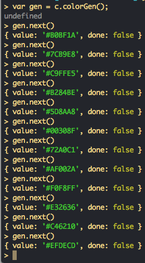

# colors

> Color generator.

Yield colors from a simple generator.

## Usage

;

```js
import colors from 'colors';

var gen = colors.colorGen();

var color1 = gen.next();
var color2 = gen.next();

```